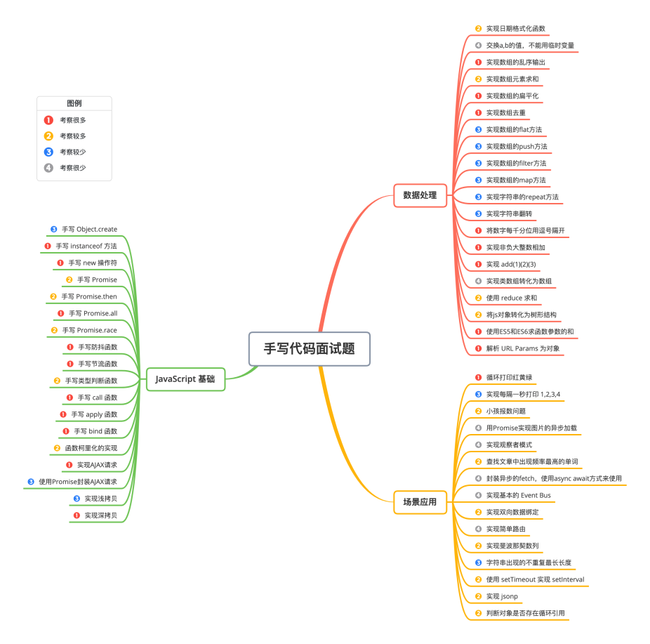

@[TOC](目录)

# JavaScript常见手写代码题
## 1、手动实现map方法（用友、猿辅导、字节）
```javascript
const obj = {
    name: 'ha',
    age: 12
}

const arr = [1, 3, , 4];
// 原生map
const newArr = arr.map(function (ele, index, arr) {
    console.log(this);
    return ele + 2;
}, obj);

console.log(newArr); //  [3, 5, , 6]
```

- 回调函数接受三个参数。分别为：**数组元素，元素索引，原数组本身**。
- map方法执行的时候，**会自动跳过未被赋值或者被删除的索引**。
- map方法返回一个新数组，而且不会改变原数组。当然，你想改变也是可以的，通过回调函数的第三个参数，即可改变原数组。
```javascript
// 方法1：
// thisArg参数就是用来改变回调函数内部this的
Array.prototype.myMap = function (fn, thisArg) {
    // // 首先，检查传递的参数是否正确。
    if (typeof fn !== "function") {
        throw new TypeError(fn + " is not a function");
    }

    // 每次调用此函数时，我们都会创建一个 res 数组, 因为我们不想改变原始数组。
    let res = [];
    for (let i = 0; i < this.length; i++) {
        // 简单处理空项
        this[i] ? res.push(fn.call(thisArg, this[i], i, this)) : res.push(this[i]);
    }
    return res;
};


// 方法2：用reduce实现map方法
Array.prototype.myMap = function(fn, thisArg){
    if (this === null) {
        throw new TypeError("this is null or not defined");
    }
    if (typeof fn !== "function") {
        throw new TypeError(fn + " is not a function");
    }
    var res = [];
    this.reduce(function(pre, cur, index, arr){
            return res.push(fn.call(thisArg, cur, index, arr));
    }, []);
    return res;
}

// 或者
Array.prototype.myMap = function (fn, thisArg) {
  return this.reduce((acc, cur, index, array) => {
    const res = fn.call(thisArg, cur, index, array);
    acc.push(res);
    return acc;
  }, []);
};

// 测试
var arr = [2,3,1,5];
arr.myMap(function(item,index,arr){
    console.log(item,index,arr);
})
```
[参考链接](https://blog.csdn.net/qq_40713392/article/details/105929437)<br />[参考链接](https://www.jianshu.com/p/ed37f8944e4b)

## 2、手动实现reduce方法
```javascript
// 实现
Array.prototype.myReduce = function(fn, initValue) {
    // 边界条件判断
    if(typeof fn !== 'function') {
        console.error('this is not a function');
    }
    // 初始值
    let preValue, curValue, curIndex;
    if(typeof initValue === 'undefined') {
        preValue = this[0];
        curValue = this[1];
        curIndex = 1;
    } else {
        preValue = initValue;
        curValue = this[0];
        curIndex = 0;  
    }
    // 遍历
    for (let i = 0; i < this.length; i++) {
        preValue = fn(preValue, this[i], i, this)
    }
    return preValue;
}
```
[reduce手写方法链接](https://mdnice.com/writing/64a6579ab8964a8d9e5a030519cd4b9e)


## 3、实现防抖函数
```javascript
// 实现
//参数func：需要防抖的函数
//参数delayTime：延时时长，单位ms
function debounce(func, delayTime) {
    //用闭包路缓存延时器id
    let timer;
    return function (...args) {
        if (timer) {
        	clearTimeout(timer);  //清除-替换，把前浪拍死在沙滩上
        } 
        timer = setTimeout(() => { // 延迟函数就是要晚于上面匿名函数
            func.apply(this, args); // 执行函数
        }, delayTime);
    }
}


// 测试
const task = () => { console.log('run task') }
const debounceTask = debounce(task, 1000)
window.addEventListener('scroll', debounceTask)
```

## 4、实现节流函数
```javascript
// 节流函数
function throttle(fn, delay) {
	let timer = null;
	return function(...args) {
		if(timer) {
			return;
		}
		timer = setTimeout(() => {
			fn.apply(this, args);
			timer = null;
		}, delay)
	}
}


// 测试
function print(e) {
	console.log('123', this, e)
}
input.addEventListener('input', throttle(print, 1000));
```

## 5、实现深拷贝函数（面试）
```javascript
function deepCopy(obj, cache = new WeakMap()) {
  // 数据类型校验
  if (!obj instanceof Object) return obj;
  
  // 防止循环引用，
  if (cache.get(obj)) return cache.get(obj);
  
  // 支持函数
  if (obj instanceof Function) {
    return function () {
      obj.apply(this, arguments);
    }
  }
  // 支持日期
  if (obj instanceof Date) return new Date(obj);
  
  // 支持正则对象
  if (obj instanceof RegExp) return new RegExp(obj.source, obj.flags);
  // 还可以增加其他对象，比如：Map, Set等，根据情况判断增加即可，面试点到为止就可以了

  // 数组是 key 为数字素银的特殊对象
  const res = Array.isArray(obj) ? [] : {};
  
  // 缓存 copy 的对象，用于处理循环引用的情况
  cache.set(obj, res);

  Object.keys(obj).forEach((key) => {
    if (obj[key] instanceof Object) {
      res[key] = deepCopy(obj[key], cache);
    } else {
      res[key] = obj[key];
    }
  });
  return res;
}


// 测试
const source = {
  name: 'Jack',
  meta: {
    age: 12,
    birth: new Date('1997-10-10'),
    ary: [1, 2, { a: 1 }],
    say() {
      console.log('Hello');
    }
  }
}
source.source = source
const newObj = deepCopy(source)
console.log(newObj.meta.ary[2] === source.meta.ary[2]);
```
附加：**JSON.stringify深拷贝的缺点**

- 如果obj里有RegExp(正则表达式的缩写)、Error对象，则序列化的结果将只得到空对象；
- 如果obj里面有时间对象，时间将只是字符串的形式，而不是对象的形式;
- 如果obj里有函数，undefined，则序列化的结果会把函数或 undefined丢失；
- 如果obj里有NaN、Infinity和-Infinity，则序列化的结果会变成null;
- **如果对象中存在循环引用的情况也无法正确实现深拷贝，思路：**我们设置一个数组或者哈希表存储已拷贝过的对象，当检测到当前对象已存在于哈希表中时，取出该值并返回即可，如上。
- // 例如: a:{b:{c:{d: null}}}, d=a, a 的深拷贝对象是 copy, 则 weakmap 里保存一条 a->copy 记录，当递归拷贝到d, 发现d指向a，而a已经存在于weakmap，则让新d指向copy
```javascript
var test = {
    a: new RegExp('\\w+'),
    b: new Date(1536627600000),
    c: undefined,
    d: function() {},
    e: NaN
  };
console.log(JSON.parse(JSON.stringify(test)));
// 结果
// {
//     a: {},
//     b: "2018-09-11T01:00:00.000Z",
//     e: null
// }
```
[链接](https://www.jianshu.com/p/52db1d0c1780)
[链接](https://muyiy.cn/blog/4/4.3.html#%E7%AC%AC%E4%B8%89%E6%AD%A5%EF%BC%9A%E5%BE%AA%E7%8E%AF%E5%BC%95%E7%94%A8)

## 实现new函数（面试）
```javascript
// 实现
function mynew(Func, ...args) {
    // 1.创建一个新对象
    const obj = {};
    // 2.新对象原型指向构造函数原型对象
    obj.__proto__ = Func.prototype;
    // 3.将构建函数的this指向新对象 (让函数的 this 指向这个对象，执行构造函数的代码（为这个新对象添加属性）)
    let result = Func.apply(obj, args);
    // 4.根据返回值判断
    return result instanceof Object ? result : obj;
}


// 测试
function Person(name, age) {
    this.name = name;
    this.age = age;
}
Person.prototype.say = function () {
    console.log(this.name)
}

let p = mynew(Person, "huihui", 123)
console.log(p) // Person {name: "huihui", age: 123}
p.say() // huihui
```

注意：

| **类型** | **说明** |
| --- | --- |
| 不 return 和 return 值类型 | 结果就是输出 Person { name: 'wang' }，这是正常的。 |
| return 引用类型 | 输出了 { age: 18 }，也就是我们return的引用类型，此时，我们若创建原型方法也不会挂到实例上，调用时会报错**TypeError**。 |

```javascript
function Person(name) {
  this.name = name;
  // return 1; // 情况1：return 值类型，结果为{name: 'wang'}
  // return { age: 18 }; // 情况2：return 引用类型，结果为{ age: 18 }
}
const p = new Person('wang')
console.log(p)
```

## 事件总线 | 发布订阅模式（快手、滴滴）
[✅参考链接](https://www.jianshu.com/p/e0575e17de2a)
[手写js发布订阅模式以及观察者模式](https://www.jianshu.com/p/bcc7d35e5ae0)

```javascript
// 发布订阅模式
class EventEmitter {
    constructor() {
        // 事件对象，存放订阅的名字和事件
        this.events = {};
    }
    // 订阅事件的方法
    on(eventName, callback) {
       if (!this.events[eventName]) {
           // 注意时数据，一个名字可以订阅多个事件函数
           this.events[eventName] = [callback]
       } else  {
          // 存在则push到指定数组的尾部保存
           this.events[eventName].push(callback)
       }
    }
    // 移除订阅事件
    off(eventName, callback) {
        if (!this.events[eventName]) {
	      return new Error('事件无效');
	    }
        if (this.events[eventName]) {
            this.events[eventName] = this.events[eventName].filter(cb => cb != callback);
        }
    }
    // 只执行一次订阅的事件，然后移除
    once(eventName, callback) {
        // 绑定的时fn, 执行的时候会触发fn函数
        let fn = () => {
           callback(); // fn函数中调用原有的callback
           this.off(eventName, fn); // 删除fn, 再次执行的时候之后执行一次
        }
        this.on(eventName, fn);
    }
    // 触发事件的方法
    emit(eventName) {
        // 遍历执行所有订阅的事件
       this.events[eventName] && this.events[eventName].forEach(cb => cb());
    }
}


// 测试
let em = new EventEmitter();
let workday = 0;
em.on("work", function() {
    workday++;
    console.log("work everyday");
});

em.once("love", function() {
    console.log("just love you");
});

function makeMoney() {
    console.log("make one million money");
}
em.on("money",makeMoney);

let time = setInterval(() => {
    em.emit("work");
    em.off("money",makeMoney);
    em.emit("money");
    em.emit("love");
    if (workday === 5) {
        console.log("have a rest")
        clearInterval(time);
    }
}, 1000);
```

## 柯西化函数（知乎）
柯里化（currying） 指的是`将一个多参数的函数拆分成一系列函数，每个拆分后的函数都只接受一个参数。`<br />柯里化是一种函数的转换，它是指将一个函数从可调用的 f(a, b, c) 转换为可调用的 `f(a)(b)(c)`。柯里化不会调用函数。它只是对函数进行转换。<br />[视频讲解](https://www.bilibili.com/video/BV1yS4y1C786/?spm_id_from=333.788&vd_source=6223af80f0d3af90c7943b1db211f730)<br />[人类高质量JS函数柯里化](https://bbs.huaweicloud.com/blogs/300370)
[一文带你搞懂JavaScript Currying（柯里化）函数](https://cloud.tencent.com/developer/article/1885618)
```javascript
// 函数求和
function sumFn(...rest) {
    return rest.reduce((a, b) => a + b);
}
// 柯里化函数
var currying = function (func) {
    // 保存所有传递的参数
    const args = [];
    return function result(...rest) {
        // 最后一步没有传递参数，如下例子
        if(rest.length === 0) {
            return func(...args);
        } else {
            // 中间过程将参数push到args
            args.push(...rest);
            return result; // 链式调用
        }
    }
}

// 测试
currying(sumFn)(1)(2)(3)(4)(); // 10
currying(sumFn)(1, 2, 3)(4)(); // 10


// es6 实现
function curry(fn, ...args) {
  return fn.length <= args.length ? fn(...args) : curry.bind(null, fn, ...args);
}

// 第二种方式
function curry(func) { 
  return function curried(...args) {  
    if (args.length >= func.length) {
      return func.apply(this, args);  
    } 
    else {
      return function(...args2) {
      	return curried.apply(this, args.concat(args2)); 
    	}   
    } 
  };
}

// test
function sum(a, b, c) {  
  return a + b + c;}
let curriedSum = curry(sum);
alert( curriedSum(1, 2, 3) ); // 6，仍然可以被正常调用
alert( curriedSum(1)(2,3) ); // 6，对第一个参数的柯里化
alert( curriedSum(1)(2)(3) ); // 6，全柯里化
```

## 实现instanceof（虾皮）
` instanceof `运算符用于检测构造函数的` prototype `属性是否出现在某个实例对象的原型链上。
```javascript
// 方法1
function isInstanceOf(instance, klass) {
  let proto = instance.__proto__;
  let prototype = klass.prototype;
  while (true) {
    if (proto === null) return false;
    if (proto === prototype) return true;
    proto = proto.__proto__;
  }
}

// 测试
class Parent {}
class Child extends Parent {}
const child = new Child()
console.log(isInstanceOf(child, Parent), isInstanceOf(child, Child), isInstanceOf(child, Array))
// true true false


// 方法2
function myInstanceof(left, right) {
  // 获取对象的原型
  let proto = Object.getPrototypeOf(left)
  // 获取构造函数的 prototype 对象
  let prototype = right.prototype; 
 
  // 判断构造函数的 prototype 对象是否在对象的原型链上
  while (true) {
    if (!proto) return false;
    if (proto === prototype) return true;
    // 如果没有找到，就继续从其原型上找，Object.getPrototypeOf方法用来获取指定对象的原型
    proto = Object.getPrototypeOf(proto);
  }
}
```
`Object.create()` 静态方法以一个现有对象作为原型，创建一个新对象。
```javascript
const person = {
  isHuman: false,
  printIntroduction: function () {
    console.log(`My name is ${this.name}. Am I human? ${this.isHuman}`);
  },
};

const me = Object.create(person);

me.name = 'Matthew'; // "name" is a property set on "me", but not on "person"
me.isHuman = true; // Inherited properties can be overwritten

me.printIntroduction();
// Expected output: "My name is Matthew. Am I human? true"
```

[instanceof mdn介绍](https://developer.mozilla.org/zh-CN/docs/Web/JavaScript/Reference/Operators/instanceof)

## 实现promise.all（美团）
#### 1) 核心思路
- 接收一个 Promise 实例的数组或具有 Iterator 接口的对象作为参数
- 这个方法返回一个新的 promise 对象，
- 遍历传入的参数，用Promise.resolve()将参数"包一层"，使其变成一个promise对象
- 参数所有回调成功才是成功，返回值数组与参数顺序一致
- 参数数组其中一个失败，则触发失败状态，第一个触发失败的 Promise 错误信息作为 Promise.all 的错误信息。
#### 2）实现代码
一般来说，Promise.all 用来处理多个并发请求，也是为了页面数据构造的方便，将一个页面所用到的在不同接口的数据一起请求过来，不过，如果其中一个接口失败了，多个请求也就失败了，页面可能啥也出不来，这就看当前页面的耦合程度了
```javascript
function promiseAll(promises) {
    return new Promise((resolve, reject) => {
        if(!Array.isArray(promises)){
            throw new TypeError(`argument must be a array`)
        }
        var resolvedCounter = 0;
        var promiseNum = promises.length;
        var resolvedResult = [];
        for (let i = 0; i < promiseNum; i++) {
            Promise.resolve(promises[i]).then(value=>{
                resolvedCounter++;
                resolvedResult[i] = value;
                if (resolvedCounter == promiseNum) {
                    resolve(resolvedResult)
                }
            },error=>{
                reject(error)
            })
        }
    })
}
// 测试
let p1 = new Promise(function (resolve, reject) {
    setTimeout(function () {
        resolve(1)
    }, 1000)
})
let p2 = new Promise(function (resolve, reject) {
    setTimeout(function () {
        resolve(2)
    }, 2000)
})
let p3 = new Promise(function (resolve, reject) {
    setTimeout(function () {
        resolve(3)
    }, 3000)
})
promiseAll([p3, p1, p2]).then(res => {
    console.log(res) // [3, 1, 2]
})
```

## 实现promise.race（58同城）
该方法的参数是` Promise `实例数组, 然后其` then `注册的回调方法是数组中的某一个 Promise 的状态变为` fulfilled `的时候就执行. 因为 Promise 的状态只能改变一次, 那么我们只需要把` Promise.race `中产生的 Promise 对象的` resolve `方法, 注入到数组中的每一个 Promise 实例中的回调函数中即可.
```javascript
Promise.race = function (promises) {
    return new Promise((resolve, reject) => {
        promises.forEach(promise => {
            promise.then(resolve, reject)
        })
    })
}
```
## 模拟实现 Promise.finally
```javascript
Promise.prototype.finally = function (callback) {
  let P = this.constructor;
  return this.then(
    value  => P.resolve(callback()).then(() => value),
    reason => P.resolve(callback()).then(() => { throw reason })
  );
};
```
[链接](https://github.com/Advanced-Frontend/Daily-Interview-Question/issues/109)


## 实现_.groupBy方法（蚂蚁）

/**
请你编写一段可应用于所有数组的代码，使任何数组调用 array. groupBy(fn) 方法时，它返回对该数组 分组后 的结果。
数组 分组 是一个对象，其中的每个键都是 fn(arr[i]) 的输出的一个数组，该数组中含有原数组中具有该键的所有项。
提供的回调函数 fn 将接受数组中的项并返回一个字符串类型的键。
每个值列表的顺序应该与元素在数组中出现的顺序相同。任何顺序的键都是可以接受的。
请在不使用 lodash 的 _.groupBy 函数的前提下解决这个问题。
例如：输入：
array = [{"id":"1"}, {"id":"1"}, {"id":"2"}], 
fn = function (item) { 
   return item.id; 
}
输出：
{ 
"1": [{"id": "1"}, {"id": "1"}],   
"2": [{"id": "2"}] 
}
 */

```javascript
pending
```


## 实现浏览器的缓存数据的存取（蚂蚁）

编写一个类，它允许获取和设置键-值对，并且每个键都有一个过期时间。类似浏览器的缓存数据的存取，存入的数据可设置过期时间
该类有三个公共方法:
- set(key, value, duration) ：接收参数为整型键 key 、整型值 value 和以毫秒为单位的持续时间 duration 。一旦 duration 到期后，这个键就无法访问。如果相同的未过期键已经存在，该方法将返回 true ，否则返回 false 。如果该键已经存在，则它的值和持续时间都应该被覆盖。
- get(key) ：如果存在一个未过期的键，它应该返回这个键相关的值。否则返回 -1 。
- count() ：返回未过期键的总数。
```javascript
pending
```


## 模拟浏览器限制最大并发请求数量（蚂蚁）

用js实现一个请求方法，模拟浏览器限制最大并发请求数量，最多并发6个。
由于每个请求执行时间不确定，因此前6个请求应该会立即被发送，而后面的请求会等待前面的请求完成后再发送，比如我先一起发调用了4次请求，等待300ms后又一起发送了4个请求，那真正发出的请求只有前6个，后面2个要排队，等有空闲时请求发出去，并当请求返回数据后能正确返回给调用方。

实现控制并发请求个数
js封装一个请求函数，可以5个并发请求，等其中一个结束后面的补上，直到结束。<br />[链接](https://blog.51cto.com/u_15685951/5577417)<br />[参考链接](https://blog.csdn.net/cdy_1/article/details/132277626)<br />[链接](https://juejin.cn/post/7203648441720225852)


```javascript
pending
```
## 手写call、apply、bind
`call()、apply()、bind()`这两个方法的作用可以简单归纳为改变`this`指向，从而让我们的`this`指向不在是谁调用了函数就指向谁。
> 每个JavaScript函数都是Function对象，Function对象是构造函数，而它的原型对象是Function.prototype，这个原型对象上有很多属性可以使用，比如说call就是从这个原型对象上来的。如果我们要模仿，必须在这个原型对象上添加和call一样的属性（或者说方法）。

```javascript
// 三者的使用
var obj = {
    x: 81,
};
 
var foo = {
    getX: function() {
        return this.x;
    }
}
 
console.log(foo.getX.bind(obj)());  //81
console.log(foo.getX.call(obj));    //81
console.log(foo.getX.apply(obj));   //81
```
参考链接：<br />[✅手写 实现call、apply和bind方法 超详细！！！](https://blog.csdn.net/weixin_45844049/article/details/118026630)<br />[✅手写bind](https://vue3js.cn/interview/JavaScript/bind_call_apply.html#%E4%B8%89%E3%80%81%E5%AE%9E%E7%8E%B0)<br />[视频讲解](https://www.bilibili.com/video/BV1m54y1q7hc/?spm_id_from=333.788&vd_source=6223af80f0d3af90c7943b1db211f730)
```javascript
// call方法实现
Function.prototype.myCall = function(context) {
    // 判断调用对象
    if(typeof this !== 'function') {
        console.error('type error');
    }
    // 判断call方法是否有传值，如果是null或者是undefined，指向全局变量window
    context = context || window;
    // 获取除了this指向对象以外的参数, 空数组slice后返回的仍然是空数组
    let args = [...arguments].slice(1);
    let result = null;
    // 获取调用call的函数，用this可以获取
    context.fn = this; // this指向的是使用call方法的函数(Function的实例，即下面测试例子中的bar方法)
    result = context.fn(...args); //隐式绑定,当前函数的this指向了context.
    // 将属性删除
    delete context.fn;
    return result;
}


//测试代码
var foo = {
    name: 'Selina'
}
var name = 'Chirs';
function bar(job, age) {
    console.log(this.name);
    console.log(job, age);
}
bar.myCall(foo, 'programmer', 20);
// Selina 
// programmer 20
bar.myCall(null, 'teacher', 25);
// undefined
// teacher 25
```
#### call 和 apply 的区别是什么，哪个性能更好一些
call 比 apply 的性能好, 我的理解是内部少了一次将 apply 第二个参数解构的操作
```javascript
// apply的实现
Function.prototype.myApply = function (context) {
    if (!context) {
        //context为null或者是undefined时,设置默认值
        context = typeof window === 'undefined' ? global : window;
    }
    context.fn = this;
    let result = null;
    if(arguments[1]) {
        // 第二个参数有值的话
        result = context.fn(...arguments[1]);
    } else {
        result = context.fn();
    }
    // 删除属性
    delete context.fn;
    return result;
}


// 测试代码
var foo = {
    name: 'Selina'
}
var name = 'Chirs';
function bar(job, age) {
    console.log(this.name);
    console.log(job, age);
}
bar.myApply(foo, ['programmer', 20]);
// Selina programmer 20
bar.myApply(null, ['teacher', 25]);
// Chirs teacher 25
```

```javascript
// bind方法
Function.prototype.myBind = function (context) {
    // 判断调用对象是否为函数
    if (typeof this !== "function") {
        throw new TypeError("Error");
    }

    // 获取参数
    const args = [...arguments].slice(1), fn = this;

    return function Fn() {
        // 根据调用方式，传入不同绑定值
        return fn.apply(this instanceof Fn ? new fn(...arguments) : context, args.concat(...arguments)); 
    }
}

// 解析：
// 1、bind会返回一个函数
// 2、注意点：函数返回一个函数，很容易造成this的丢失
// 3、bind的实现，里面用到了上面已经实现的apply方法，所以这里直接复用
// 4、bind可以和new进行配合使用，new的过程会使this失效
// 5、三目运算符就是判断是否使用了new
// 6、this instanceof Fn的目的：判断new出来的实例是不是返回函数Fn的实例
```
## 手写promise（一般情况下不会考，因为太费时间）
[视频讲解](https://www.bilibili.com/video/BV1RR4y1p7my/?spm_id_from=333.788&vd_source=6223af80f0d3af90c7943b1db211f730)<br />[史上最最最详细的手写Promise教程](https://www.cnblogs.com/sugar-tomato/p/11353546.html)
```javascript
class MyPromise {
    static PENDING = "pending";
    static FULFILLED = "fulfilled";
    static REJECTED = "rejected";
    constructor(func) {
        this.status = MyPromise.PENDING; // 状态
        this.result = null; // 参数
        this.resolveCallbacks = [];
        this.rejectCallbacks = [];
        // 异常校验，为了兼容下面的代码：throw new Error('抛出失败');
        try {
            func(this.resolve.bind(this), this.reject.bind(this));
        } catch (error) {
            this.reject(error);
        }
        
    }
    resolve(result) {
        // resolve和reject函数是在函数的末尾执行的，所以加一层setTimeout
        setTimeout(() => {
            if(this.status === MyPromise.PENDING) {
                this.status = MyPromise.FULFILLED;
                this.result = result;
                this.resolveCallbacks.forEach(callback => {
                    callback(result);
                });
            }
        })
    }
    reject(result) {
        // resolve和reject函数是在函数的末尾执行的，所以加一层setTimeout
        setTimeout(() => {
            if(this.status === MyPromise.PENDING) {
                this.status = MyPromise.REJECTED;
                this.result = result;
                this.rejectCallbacks.forEach(callback => {
                    callback(result);
                });
            }
        })
    }
    // then函数有两个函数参数
    then(onSuccess, onError) {
        // 外层return promise的目的是为了完成链式调用
        return new MyPromise((resolve, reject) => {
            // then方法中的参数必须是函数，如果不是函数就忽略
            onSuccess = typeof onSuccess === 'function' ? onSuccess : () => {};
            onError = typeof onError === 'function' ? onError : () => {};
    
            // 如果then里面的状态为pending, 必须等resolve执行完之后在执行then, 所以需要创建数组，保留then里面的函数
            if(this.status = MyPromise.PENDING) {
                this.resolveCallbacks.push(onSuccess);
                this.rejectCallbacks.push(onError);
            }
            
            // 如果then方法执行的是成功的函数
            if(this.status === MyPromise.FULFILLED) {
                // 包裹setTimeout，解决异步问题，then放阿飞执行是微任务
                setTimeout(() => {
                    onSuccess(this.result);
                });
            }
            // 如果then方法执行的是失败的函数
            if(this.status === MyPromise.REJECTED) {
                // 同上
                setTimeout(() => {
                    onSuccess(this.result);
                });
            } 
        })  
    }
}


// 测试
console.log('第一步');
let promise1 = new MyPromise((resolve, reject) => {
    console.log('第二步');
    setTimeout(() => {
        resolve('这次一定');
        reject('下次一定');
        console.log('第四步');
    });
    // resolve('这次一定');
    // throw new Error('抛出失败');
});
promise1.then(
    result => {console.log(result)},
    err => {console.log(err.message)},
);
console.log('第三步');
```
## 数组扁平化
```javascript
// 方案 1
function test(arr = []) {
    return arr.flat(Infinity);
}
test([1, 2, [3, 4, [5, 6]], '7'])


// 方案 2
function reduceFlat(ary = []) {
  return ary.reduce((res, item) => res.concat(Array.isArray(item) ? reduceFlat(item) : item), [])
}

// 测试
const source = [1, 2, [3, 4, [5, 6]], '7']
console.log(reduceFlat(source))
```
## 对象扁平化
```javascript
// 需求：
var output = {
  a: {
   b: {
     c: {
       dd: 'abcdd'
     }
   },
   d: {
     xx: 'adxx'
   },
   e: 'ae'
  }
}

// 要求转换成如下对象
var entry = {
  'a.b.c.dd': 'abcdd',
  'a.d.xx': 'adxx',
  'a.e': 'ae'
}

// 实现方案
function objectFlat(obj = {}) {
  const res = {};
  
  function flat(item, preKey = '') {
    Object.entries(item).forEach(([key, val]) => {
      const newKey = preKey ? `${preKey}.${key}` : key;
      if (val && typeof val === 'object') {
        flat(val, newKey);
      } else {
        res[newKey] = val;
      }
    })
  }
  flat(obj);
  
  return res;
}

// 测试
const source = { a: { b: { c: 1, d: 2 }, e: 3 }, f: { g: 2 } }
console.log(objectFlat(source)); // {a.b.c: 1, a.b.d: 2, a.e: 3, f.g: 2}
```
## 对象扁平化反转


## 图片懒加载
[图片懒加载，手写见上面链接](https://www.bilibili.com/video/BV1FU4y157Li/?spm_id_from=333.788&vd_source=6223af80f0d3af90c7943b1db211f730)<br />原理：图片的加载是由src引起的，当对`src赋值时，浏览器就会请求图片资源` 。根据这个原理，我们使用HTML5 的`data-src` 属性来储存图片的路径，在需要加载图片的时候，将`data-src`中图片的路径赋值给src，这样就实现了图片的按需加载，即懒加载。

**预加载：**<br />预加载指的是将所需的资源提前请求加载到本地，这样后面在需要用到时就直接从缓存取资源。 通过预加载能够减少用户的等待时间，提高用户的体验。预加载的最常用的方式是使用 js 中的`image`对象，通过为`image`对象来设置 src 属性，来实现图片的预加载。<br />`预加载则会增加服务器前端压力。`
## 使用 setTimeout 实现 setInterval（待定）
```javascript
// 使用 setTimeout 实现 setInterval
function mySetInterval(fn, timeout) {
  // 控制器，控制定时器是否继续执行
  var timer = {
    flag: true
  };
  // 设置递归函数，模拟定时器执行。
  function interval() {
    if (timer.flag) {
      fn();
      setTimeout(interval, timeout);
    }
  }
  // 启动定时器
  setTimeout(interval, timeout);
  // 返回控制器
  return timer;
}


// 方法2
function mySetInterval() {
    mySetInterval.timer = setTimeout(() => {
        arguments[0]()
        mySetInterval(...arguments)
    }, arguments[1])
}

mySetInterval.clear = function() {
    clearTimeout(mySetInterval.timer)
}

mySetInterval(() => {
    console.log(11111)
}, 1000)

setTimeout(() => {
    // 5s 后清理
    mySetInterval.clear()
}, 5000)
```

## 实现 jsonp 
```javascript
// 实现 jsonp 
// 动态的加载js文件
function addScript(src) {
  const script = document.createElement('script');
  script.src = src;
  script.type = "text/javascript";
  document.body.appendChild(script);
}
addScript("http://xxx.xxx.com/xxx.js?callback=handleRes");
// 设置一个全局的callback函数来接收回调结果
function handleRes(res) {
  console.log(res);
}
// 接口返回的数据格式
handleRes({a: 1, b: 2});
```

## 实现prototype继承
```javascript
// 实现prototype继承
// 所谓的原型链继承就是让新实例的原型等于父类的实例：

//父方法
function SupperFunction(flag1){
    this.flag1 = flag1;
}

//子方法
function SubFunction(flag2){
    this.flag2 = flag2;
}

//父实例
var superInstance = new SupperFunction(true);

//子继承父
SubFunction.prototype = superInstance;

//子实例
var subInstance = new SubFunction(false);
//子调用自己和父的属性
subInstance.flag1;   // true
subInstance.flag2;   // false
```

## 实现indexOf
实现一个字符串匹配算法，从长度为 n 的字符串 S 中，查找是否存在字符串 T，T 的长度是 m，若存在返回所在位置。
```javascript
const find = (S, T) => {
  if (S.length < T.length) return -1;
  for (let i = 0; i < S.length; i++) {
    if (S.slice(i, i + T.length) === T) return i
  }
  return -1;
}
// 待定
const find = (S,T) => S.indexOf(T)
```
### 其他手写代码：
1、手写获取数组的重复元素，要求尽可能用多种方法实现（小米）
3、用 promise 封装实现 readfile 和 writefile 的同步请求（百度）<br />
4、 手写 Promise（字节、百度、深信服、小红书）
9、手写虚拟 dom 转换成真实 dom（字节）
10、手写 assign，要考虑全面，包括 symbol 也要考虑在内（猿辅导）
11、手写 ES6 的模板字符串（百度）

# 数据处理
## 解析 URL Params 为对象（用友）
```javascript
let url = 'http://www.domain.com/?user=anonymous&id=123&id=456&city=%E5%8C%97%E4%BA%AC&enabled';
parseParam(url)
/* 结果
{ user: 'anonymous',
  id: [ 123, 456 ], // 重复出现的 key 要组装成数组，能被转成数字的就转成数字类型
  city: '北京', // 中文需解码
  enabled: true, // 未指定值得 key 约定为 true
}
*/

// 方法1：利用new URLSearchParams方法
// 常用new URLSearchParams(location.search)来获取url的参数
function parseParam(url) {
    let list = new URLSearchParams(url.split('?')[1]);
    let res = {};
    for (let [k, v] of list.entries()) {
        v = v ? v : true;
        if(res[k]) {
            res[k] = [res[k]];
            res[k].push(v);
        } else {
            res[k] = v;
        }
    }
    return res;
}

// 方法2：正则表达式
function parseParam(url) {
  const paramsStr = /.+\?(.+)$/.exec(url)[1]; // 将 ? 后面的字符串取出来
  const paramsArr = paramsStr.split('&'); // 将字符串以 & 分割后存到数组中
  let paramsObj = {};
  // 将 params 存到对象中
  paramsArr.forEach(param => {
    if (/=/.test(param)) { // 处理有 value 的参数
      let [key, val] = param.split('='); // 分割 key 和 value
      val = decodeURIComponent(val); // 解码
      val = /^\d+$/.test(val) ? parseFloat(val) : val; // 判断是否转为数字
      if (paramsObj.hasOwnProperty(key)) { // 如果对象有 key，则添加一个值
        paramsObj[key] = [].concat(paramsObj[key], val);
      } else { // 如果对象没有这个 key，创建 key 并设置值
        paramsObj[key] = val;
      }
    } else { // 处理没有 value 的参数
      paramsObj[param] = true;
    }
  })
  return paramsObj;
}
```

## 
```javascript

```

## 
```javascript

```

## 
```javascript

```

## 
```javascript

```

## 
```javascript

```


## 
```javascript

```

## 
```javascript

```

## 
```javascript

```
# 场景应用


# 相关参考链接
[前端面试出场率奇高的18个手写代码](https://www.jianshu.com/p/810fd449a552)